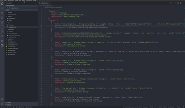

[pure-bash-bible]: https://github.com/dylanaraps/pure-bash-bible

# pbbs

[](https://marketplace.visualstudio.com/items?itemName=pombadev.pbbs)
[](https://marketplace.visualstudio.com/items?itemName=pombadev.pbbs)

`pbbs` is a VS Code snippets extension that has a collection of pure bash alternatives to external processes.

All of the snippets were extracted, re-formatted and modified by me from the [pure-bash-bible] repo.

# Demo

[](./images/demo.gif)

# Installation

Launch VS Code Quick Open (Ctrl+P), paste the following command, and press enter.

```text
ext install pombadev.pbbs
```

Or open extensions in sidebar (Ctrl+Shift+X), search `Pure Bash Bible` and install.

The snippets are available in `shellscript` & `markdown` languages only.

# Features

# Acknowledgement

All the snippets were authored by [dylan](https://github.com/dylanaraps) and the [contributors](https://github.com/dylanaraps/pure-bash-bible/graphs/contributors) of [pure-bash-bible] check them out!
